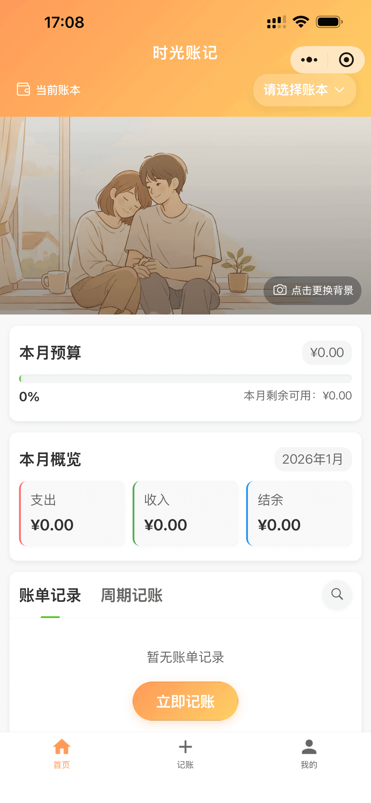
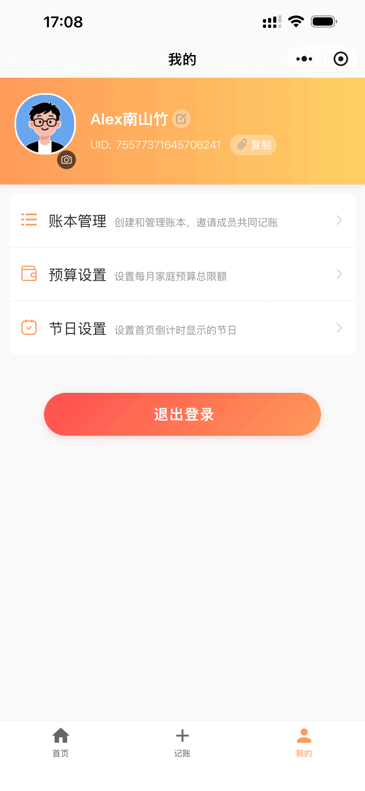

# Momento API

「时光账记」API —— 每一笔账单，都是生活的旁白。

[](https://golang.org/)
[](https://go-zero.dev/)
[](LICENSE)

**Momento API** 是微信小程序“时光账记”的后端服务，基于 [go-zero](https://github.com/zeromicro/go-zero) 微服务框架构建。这是一款专注于个人财务管理与生活记录的应用，旨在帮助用户通过简洁的方式记录收支、管理周期性账单以及关注重要节日。

## 源码

- 前端小程序端源码：[Momento MiniApp](https://github.com/pudongping/momento-miniapp) 或者 [Momento MiniApp (Gitee)](https://gitee.com/pudongping/momento-miniapp)
- 后端 API 接口源码：[Momento API](https://github.com/pudongping/momento-api) 或者 [Momento API (Gitee)](https://gitee.com/pudongping/momento-api)

## 快速体验

可以直接使用微信扫描下方小程序二维码进行体验：

> 微信小程序需要完成**微信认证后，账号才可获得“被搜索”和“被分享”能力**，我没有进行**微信认证**，因此，暂时**无法通过小程序名称搜索此小程序**，只能通过扫描小程序码进行体验。

<div align="center">
  
</div>

## 📷 项目预览

<div align="center">
  
  
  
  
  
</div>

## ✨ 主要功能

- **📝 记账管理**: 快速记录日常收入与支出，支持多维度筛选与统计。
- **🔄 周期记账**: 支持设置周期性（如每月、每周）的固定收支，自动生成账单，省去重复操作。
- **🏷️ 标签管理**: 自定义账单标签，支持系统预设与用户自定义，方便分类统计。
- **🎉 节日提醒**: 内置节日管理功能，记录重要日期，不再错过每一个值得纪念的时刻。
- **👤 用户体系**: 基于微信生态的无感登录与用户信息管理，支持个性化设置（如背景图、预算设置）。

## 🛠 技术栈

本项目采用现代化的 Go 语言微服务架构：

- **核心框架**: [go-zero v1.9.4](https://go-zero.dev/) (高性能微服务框架)
- **编程语言**: Go 1.25.5+
- **数据库**: MySQL 5.7
- **缓存**: Redis
- **代码生成**: goctl v1.9.2 (极大提升开发效率)
- **身份认证**: JWT (JSON Web Token)
- **工具库**: Squirrel (SQL 构建)、Cast (类型转换)、govalidator (参数校验)等

## 📂 项目结构

遵循 go-zero 标准目录结构，清晰分层：

```bash
momento-api/
├── dsl/                 # API 定义文件 (.api, goctl DSL)
│   ├── user/            # 用户模块定义
│   ├── tag/             # 标签模块定义
│   ├── festival/        # 节日模块定义
│   ├── transaction/     # 交易模块定义
│   └── miniapp.api      # 主 API 入口
├── internal/
│   ├── config/          # 配置加载
│   ├── handler/         # HTTP 处理器 (自动生成)
│   ├── logic/           # 业务逻辑层 (核心代码)
│   ├── svc/             # 服务上下文 (依赖注入)
│   ├── model/           # 数据库模型 (DAO)
│   ├── middleware/      # 中间件 (Auth 等)
│   └── types/           # 请求/响应结构体
├── coreKit/             # 共享工具库 (错误处理, 响应封装, JWT 等)
├── etc/                 # 配置文件
├── sql/                 # 数据库 SQL 脚本
└── local_run.sh         # 开发辅助脚本
```

## 🚀 快速开始

### 本地运行

1. 克隆项目

```bash
# Github
git clone https://github.com/pudongping/momento-api.git
# 或者使用 Gitee
git clone https://gitee.com/pudongping/momento-api.git

cd momento-api
```

2. 配置环境

复制并修改配置文件：

```bash
cp etc/momentoapi.yaml.local etc/momentoapi.yaml
# 编辑 etc/momentoapi.yaml 配置 MySQL 和 Redis 连接信息
```

3. 初始化数据库

导入 `sql/` 目录下的 SQL 脚本到 MySQL 数据库。

4. 安装依赖并运行

```bash
go mod tidy
go run momentoapi.go -f etc/momentoapi.yaml
```

服务将默认启动在 `8888` 端口 (或配置文件指定的端口)。

至此，服务已经启动完毕！

### 常用开发命令

项目提供了 `local_run.sh` 脚本简化 goctl 操作：

> 强烈建议：根据自身情况调整一下 `local_run.sh` 脚本中的变量值。

```bash
# 生成 API 代码
./local_run.sh genapi

# 生成数据库模型代码
./local_run.sh model <table_name>
```

## 其他

### 建议

1. 根据项目实际情况，在每个项目下都指定确切的 Go 版本

```bash
# GOROOT 设置 go 的版本
go env -w GOROOT='~/go/sdk/go1.25.5'
```

2. 设置 GOPATH

```bash
# GOPATH 设置项目的工作目录
go env -w GOPATH='~/go/momento-api'
```

3. 设置 GOPROXY

```bash
# GOPROXY 设置 go 模块代理，推荐使用国内镜像
go env -w GOPROXY=https://goproxy.cn,direct
```

### 安装 goctl

```bash
# 两种方式都可以进行安装

# 1. 直接安装
go install github.com/zeromicro/go-zero/tools/goctl@latest

# 2. 直接使用 docker 进行安装
docker pull kevinwan/goctl:1.9.2
# 验证
docker run --rm -it -v `pwd`:/app kevinwan/goctl:1.9.2 --help
```

### 如果你想通过 goctl 创建一个全新的项目时

创建一个名称为 `miniapp` 的 `API Rest` 服务

```bash
goctl api new miniapp --style goZero
# 或者
docker run --rm -it -v `pwd`:/app kevinwan/goctl:1.9.2 api new miniapp --style goZero
```

也可以先生成 `*.api` 文件，然后根据文件自动生成 go 文件

```bash
# 在项目根目录下执行 
goctl api -o ./dsl/miniapp.api
# 或者
docker run --rm -it -v `pwd`:/app kevinwan/goctl:1.9.2 api -o ./dsl/miniapp.api
```

然后执行命令去自动生成 go 文件

```bash
# 在项目根目录下执行
goctl api go -api ./dsl/*.api -dir . --style=goZero
# 或者
docker run --rm -it -v `pwd`:/app kevinwan/goctl:1.9.2 api go -api ./dsl/*.api -dir . --style=goZero
```

### `*.api` 文件格式化美观

```bash
# 好像只能一个文件一个文件的格式化
docker run --rm -it -v `pwd`:/app kevinwan/goctl:1.9.2 api format --dir ./dsl/miniapp.api
```

## 🤝 贡献

欢迎提交 Issue 和 PR。

## License

[MIT](./LICENSE)